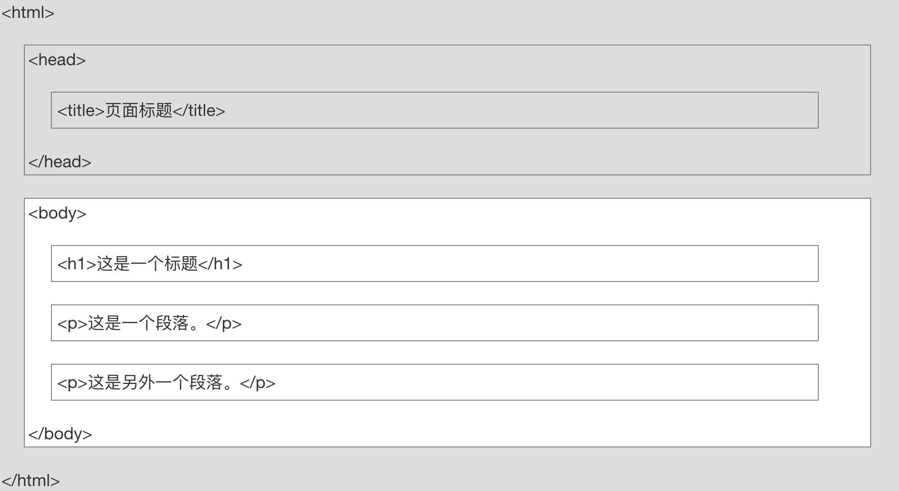
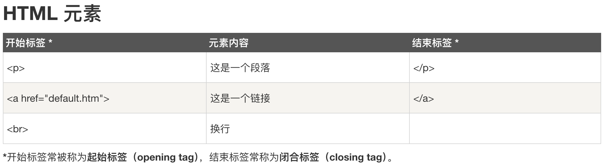

```html
<!DOCTYPE html>
<html>
<head>
<meta charset="utf-8">
<title>菜鸟教程(runoob.com)</title>
</head>
<body>
 
<h1>我的第一个标题</h1>
 
<p>我的第一个段落。</p>
 
</body>
</html>
```

# 元素

- `<html>`：整个 HTML 文档的根元素。
- `<head>`：包含文档的元信息，比如 `<title>` 标签。
- `<title>`：文档的标题，显示在浏览器的标题栏或标签页上。
- `<body>`：文档的主体，包含文档的主要内容。
- `<h1>`：一级标题，显示在页面的顶部。                    
- `<p>`：段落，显示在页面的正文中。

