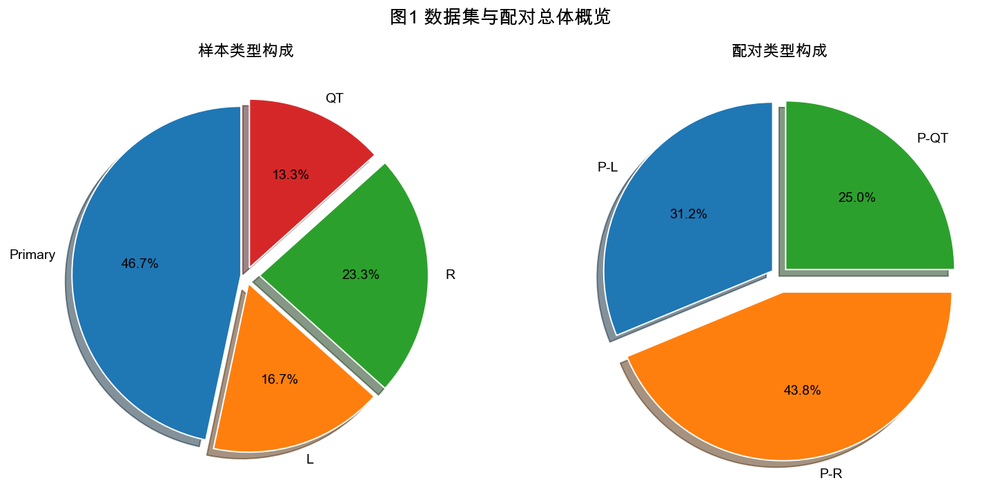
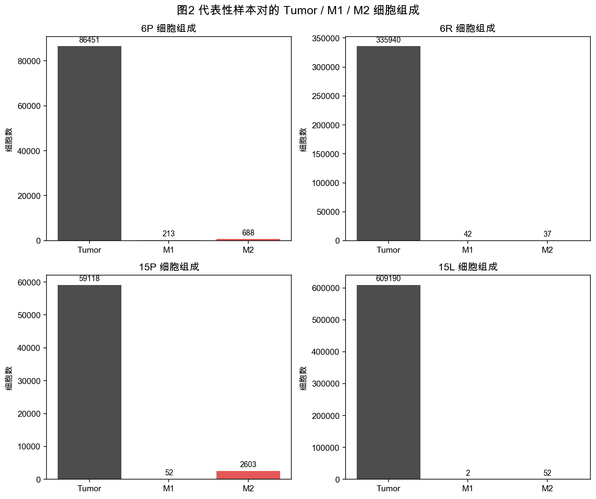
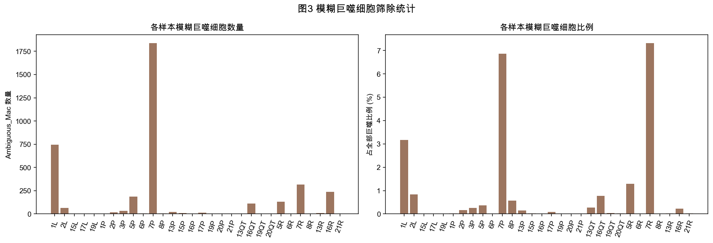
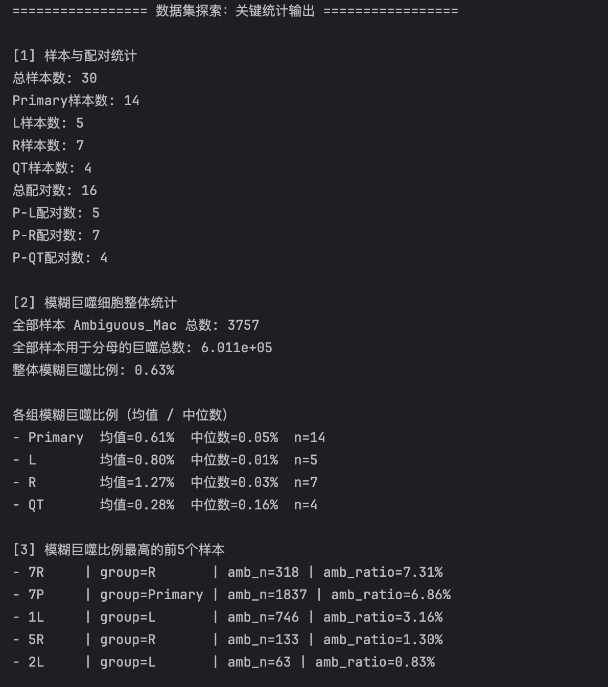
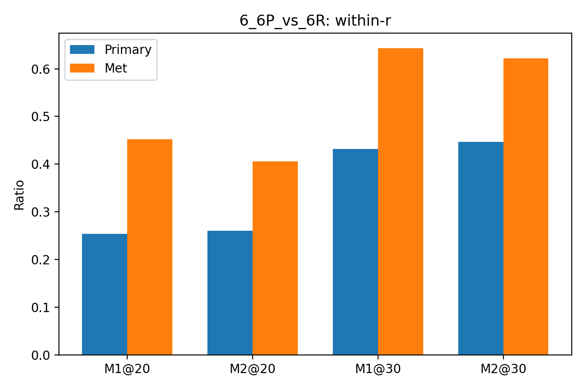
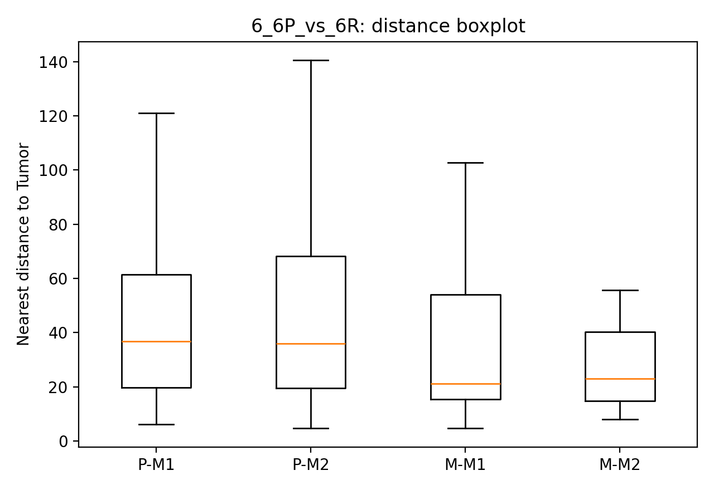
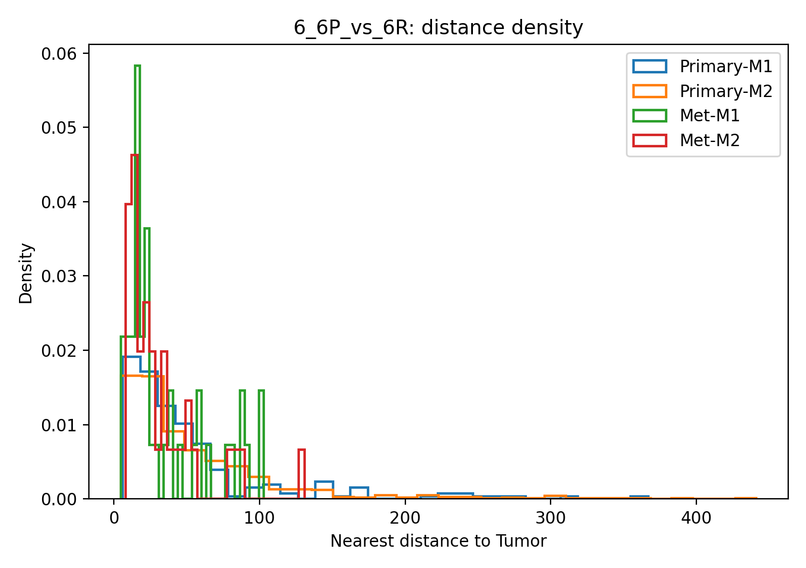

# 目标
课题核心还是比较胃癌原发灶和转移灶之间，肿瘤细胞和巨噬细胞的空间关系变化。这里我关注的不只是 M1、M2 数量多不多，更重要的是它们离肿瘤近不近、是不是贴在肿瘤边上、肿瘤周围实际接触到的是哪类细胞。

# 预处理
前期我已经把原始 CODEX 单细胞表整理好了，完成了样本配对和细胞筛选。现在 baseline 里用的是比较保守的定义：Tumor、M1、M2 先按 marker 规则明确分出来，模糊双阳性的巨噬细胞先剔除，目的是先保证分类干净，后面再考虑精进。

---

# 细胞粗分类

**当前 baseline 细胞分类规则**

| 细胞类型 | 分类规则 | 说明 |
|---|---|---|
| Tumor | PanCK+ 且 CD68- | 尽量保证肿瘤细胞不与巨噬细胞混淆 |
| Macrophage（候选） | CD68+ 且 PanCK- | 作为巨噬细胞总体候选集合 |
| M1 | CD68+、CD86+、CD163-、PanCK- | 偏促炎型巨噬细胞 |
| M2 | CD68+、CD163+、CD86-、PanCK- | 偏免疫抑制型巨噬细胞 |
| Ambiguous Macrophage | CD68+、CD86+、CD163+、PanCK- | 双阳性或模糊状态巨噬细胞，当前 baseline 先剔除 |

**说明**

当前 baseline 阶段采用的是相对保守的细胞定义方式，优先保证 Tumor、M1、M2 三类细胞的分类干净，因此对模糊双阳性的巨噬细胞先不纳入主分析。CD69 目前未进入主分类规则，但后续可作为免疫活化状态相关的扩展 marker 进一步观察。

# 空间指标选取
二月份最核心的工作其实是空间建模和指标计算。现在代码里主要用了三种空间关系定义方法：==最近邻、固定半径和 kNN==。

| 方法 | 核心问题 | 优点 | 缺点 | 最适合解释 |
|---|---|---|---|---|
| 最近邻 | 离肿瘤近不近 | 直观、易解释 | 只看最近一个点 | 靠近/远离 |
| within-r | 是否贴边 | 有群体意义、适合讲浸润 | 依赖半径选择 | 贴边/边缘富集 |
| enrich | 局部互作强不强 | 最接近局部微环境 | 受半径和密度影响 | 局部互作强度 |
| kNN | 最近邻域偏 M1 还是 M2 | 适合比较构成、对密度更稳 | 物理距离边界不明确 | 邻域组成偏向 |

最近邻就是看 M1/M2 离最近的肿瘤有多远，回答“近不近”的问题；

固定半径就是看 20 和 30 这两个范围内，细胞是不是贴着肿瘤边缘，以及肿瘤周围平均能数到多少个 M1/M2，回答“贴不贴边”和“局部互作强不强”的问题；

kNN 则是固定看肿瘤最近的 10 个巨噬邻居，判断最近的一圈环境更偏 M1 还是 M2。它们不是重复的，而是从靠近程度、边缘浸润、局部互作和邻域组成几个层次一起描述空间关系。

# 样本配对分析
三四月份我主要做的是原发灶和转移灶的病人配对比较。先把所有转移灶混在一起看，结果不够清楚，说明异质性比较大，所以后面按部位分层。现在最有结论的是 R-only，也就是右卵巢转移灶。**R-only 里能看到三个比较一致的现象：第一，M2 在巨噬细胞中的占比整体上升；第二，Tumor-M1 的局部互作下降，而且 20 和 30 两个尺度方向一致；第三，M2 虽然变多了，但并没有更贴肿瘤，很多病例里反而更外围化。所以我现在对 R 灶的理解是，它更像发生了巨噬细胞空间组织方式的重排，而不只是简单的 M2 富集。**

  

L-only 这边也不是没变化，像 1P vs 1L 这种病例就很明显，表现出 M1 和 M2 都更贴肿瘤，但放到组里以后方向不够稳定，而且有效样本数偏少，所以目前还不能把 L-only 当成主结论。现在 baseline 主体其实已经完成了，机器学习和聚类部分还没做，后面可以作为拓展亮点继续往下补

**1. 全部样本混合分析提示存在明显异质性**

在 All_pairs 层面，部分指标可见弱趋势，例如 within_20/30_M2 下降、m2_dist_median 上升，提示转移灶中的 M2 在整体上更偏离肿瘤边缘、呈外围化分布；但与 M1 相关的核心互作指标在混合分析中未表现出稳定一致方向，说明不同转移部位之间存在较强异质性，直接合并分析会稀释部位特异性模式。

**2. 按转移部位分层后，R-only 组出现最一致的空间重塑模式**

R-only 组中，diff_enrich_20_Tumor_M1 与 diff_enrich_30_Tumor_M1 均以负值为主，组内中位数分别为 -0.0056 与 -0.02，且 p≈0.06，提示右卵巢转移后 Tumor-M1 近邻互作整体减弱，且该现象在 20 与 30 两个空间尺度下方向一致，具有一定稳健性。

**3. R-only 组中巨噬细胞整体构成向 M2 偏移**

R-only 组的 diff_m2_frac_of_mac 多数为正（6/7 为正），组内中位数为 +0.15，说明右卵巢转移灶中 M2 在巨噬细胞中的占比整体升高，提示转移微环境向 M2 型构成偏移。

**4. M2 升高并不等于更贴肿瘤，R-only 更像“空间重排”**

R-only 组中，diff_within_20_M2 与 diff_within_30_M2 多数为负，组内中位数分别为 -0.13 与 -0.23，说明尽管 M2 构成上升，贴肿瘤边缘的 M2 比例并未同步增加，反而在多数病例中下降，提示 M2 更可能发生外围化分布而非向肿瘤边缘富集。

**5. 相关分析进一步支持“构成↑但贴边↓”**

在 R-only 组中，m2_frac_of_mac 与 within_20/30_M2 呈显著负相关（rho=-0.86, p=0.01），说明 M2 构成升高越明显，M2 贴肿瘤比例下降越明显；同时，m2_frac_of_mac 与肿瘤邻域中的 M2 比例正相关、与 M1 比例负相关，支持右卵巢转移灶存在巨噬细胞微环境重组。

**6. L-only 组未复现 R-only 的稳定模式**

L-only 虽然存在个别病例表现出明显“巨噬细胞向肿瘤贴近”的现象（如 1P vs 1L），但组内整体方向不一致，且很多关键指标有效样本数仅为 3–4，对统计支持不足，因此目前不宜作为主要结论。该结果反而提示左右卵巢转移灶可能并非完全同质，存在部位特异性的空间差异。

---

# 第三轮实验思路更新

前两轮复核的结论是：仅依赖 `Tumor / M1 / M2` 三类细胞时，原来的三个 baseline 结论大多只有趋势，显著性不足。第二轮综合重分析后，最稳定的结果是 `R` 组中 `M1` 相对密度下降；其余如 `M2/Tumor`、距离分布、局部窗口模式等虽然有方向，但未形成一组足够硬的显著性结果。因此决定不再继续死扣三类细胞，而是扩大到总类数仍然可控的 5 类。

第三轮固定研究 5 类细胞：

- `Tumor`：`PanCK+`
- `Macrophage`：`CD68+ & PanCK-`
- `M2_like_Macrophage`：`CD68+ & CD163+ & PanCK-`
- `CD8_T`：`CD3e+ & CD8+ & PanCK-`
- `Stromal`：`(Vimentin+ or α-SMA+) & CD31- & PanCK-`

这里 `M2_like` 使用 `like` 尾缀，是因为说明文件支持把 `CD68+CD163+` 作为 M2 方向群体，但这仍然只是基于 marker 规则定义出来的表型代理，不等于已经严格证明是真实功能状态上的 M2 细胞。`Stromal` 则按照说明文件中的 CAF/基质定义修正，必须排除 `CD31+` 和 `PanCK+`。

第三轮整体目标是把分析主线从“单一 macrophage 极化问题”升级为“肿瘤-髓系-淋巴-基质”的空间关系问题。重点回答：

1. 总巨噬细胞与 M2 样巨噬细胞在转移灶中是否发生数量、密度或空间位置变化；
2. `CD8+ T` 是否减少、是否离肿瘤更远；
3. 基质是否增强，并可能解释 M2 外围化或 CD8 排斥；
4. 是否能形成一条“基质增强 + M2_like 更靠基质 + CD8 更难靠近肿瘤”的空间链条。

第三轮代码思路如下：

1. 直接从原始 `objects.tsv` 读取必要 positivity 列和坐标列，不依赖之前的 clean 结果；
2. 按 5 类规则给每个细胞打标签；
3. 样本级指标主要计算：
   - 数量：`Macrophage_n`、`M2_like_Macrophage_n`、`CD8_T_n`
   - 相对密度：`Macrophage_density`、`M2_like_Macrophage_density`、`CD8_T_density`
   - 相对肿瘤比例：`M2_like_Macrophage_to_tumor`、`CD8_T_to_tumor`、`Stromal_to_tumor`
   - 距离：到最近 `Tumor` 的中位距离，以及 `M2_like / CD8_T` 到最近 `Stromal` 的中位距离
4. 局部窗口分析沿用 `6 x 6` 网格，但简化成 3 个窗口模式：
   - `window_m2_stromal_frac`
   - `window_cd8_tumor_frac`
   - `window_tumor_stromal_frac`
5. 只分析 `ALL / R / L` 三档，使用 paired Wilcoxon；
6. 输出严格控制为 3 个表和 8 张图以内，图形以折线图和显著性热图为主。

第三轮预期不是简单再找一个“单指标显著”，而是尝试得到更完整、可叙述的空间结构结论。如果这轮仍然无法形成稳定结论，再考虑进一步细分更多功能亚群或直接转入更明确的细胞类型扩展分析。

---

# 第三轮主线分析完整记录（用于 GPT 生成 PPT）

以下内容仅总结第三轮 **5 类细胞主线分析**，不包含后续局部窗口聚类拓展。可直接作为生成中期汇报 PPT 的 prompt 基础。

## 研究目标

在原来的 `Tumor / M1 / M2` 三类细胞分析显著性不足后，重新从原始 CODEX 数据出发，扩大到 5 类细胞，继续研究：

- 原发灶到转移灶过程中，微环境是否发生系统性空间变化；
- 哪一类细胞变化最稳定、最能支撑当前毕设主结论；
- 是否能从“巨噬细胞主线”转向“肿瘤-免疫-基质”更完整的空间叙事。

## 放弃旧主线的原因

前两轮复核后，原来的三个 baseline 结论：

- `M2 比例升高`
- `Tumor-M1 互作下降`
- `M2 更外围化`

方向上虽然存在趋势，但在配对显著性检验中始终不够稳定，尤其是 `R-only` 下也没有形成一组都能过 `p < 0.05` 的硬结论。因此决定不再把这三条作为中期汇报主线。

## 第三轮新的 5 类细胞

第三轮固定研究 5 类细胞：

- `Tumor`：`PanCK+`
- `Macrophage`：`CD68+ & PanCK-`
- `M2_like_Macrophage`：`CD68+ & CD163+ & PanCK-`
- `CD8_T`：`CD3e+ & CD8+ & PanCK-`
- `Stromal`：`(Vimentin+ or α-SMA+) & CD31- & PanCK-`

说明：

- `M2_like` 使用 `like` 尾缀，是因为 `CD68+CD163+` 只能支持“偏 M2 方向的表型”，不能严格等同于真实功能状态上的 M2 巨噬细胞。
- `Stromal` 按说明文件中 CAF/基质定义构建，明确排除 `CD31+` 和 `PanCK+`。

## 数据来源与代码

- 原始数据目录：`/Users/jia/Desktop/学习 /毕业设计/实验/CODEX全部分析数据-20260116`
- 主线代码：`/Users/jia/Desktop/学习 /Code/Python代码/毕设/三轮/1-round3_五类细胞重分析.py`
- 主线结果目录：`/Users/jia/Desktop/学习 /毕业设计/实验/3轮/round3`

## 第三轮代码思路

1. 直接从原始 `objects.tsv` 读取坐标列和 positivity 列，不依赖旧 clean 数据。
2. 按 5 类规则重新给每个细胞打标签。
3. 对每个样本计算以下几类指标：
   - 数量：`Macrophage_n`、`M2_like_Macrophage_n`、`CD8_T_n`
   - 相对密度：`Macrophage_density`、`M2_like_Macrophage_density`、`CD8_T_density`
   - 相对肿瘤比例：`M2_like_Macrophage_to_tumor`、`CD8_T_to_tumor`、`Stromal_to_tumor`
   - 距离：到最近 `Tumor` 的中位距离，以及 `M2_like / CD8_T` 到最近 `Stromal` 的中位距离
   - 简化局部窗口指标：`window_m2_stromal_frac`、`window_cd8_tumor_frac`、`window_tumor_stromal_frac`
4. 只做三档配对比较：`ALL / R / L`
5. 统计检验统一使用 paired Wilcoxon
6. 导出表格与折线图、显著性热图，控制结果规模，便于汇报

## 通俗理解：代码到底在衡量什么

- 数量：看某类细胞总共有多少，回答“这种细胞是不是整体变少了”。
- 相对密度：看同样空间范围里这种细胞是不是更稀了，回答“不是总数问题，而是局部微环境里是不是更少见了”。
- 相对肿瘤比例：看相对于肿瘤细胞，这类细胞是更强还是更弱，回答“抗肿瘤力量相对肿瘤是否下降”。
- 到肿瘤距离：看细胞离肿瘤近不近，回答“它能不能贴近肿瘤”。
- 到基质距离：看细胞是不是更靠基质，回答“是否可能存在基质屏障”。
- 局部窗口占比：看某类局部模式有没有增多或减少，但这一轮主结论不依赖窗口结果。

## 第三轮主结果

第三轮最稳定、最明确的结论不再是 `M2_like`，而是 `CD8阳性T细胞`：

- 在全部配对样本中，`CD8_T_n` 显著下降，`p = 0.01`
- 在全部配对样本中，`CD8_T_density` 显著下降，`p = 0.00`（表示数值极小，导出时四舍五入）
- 在全部配对样本中，`CD8_T_to_tumor` 显著下降，`p = 0.00`
- 在 `R` 组中，`CD8_T_density` 显著下降，`p = 0.02`
- 在 `R` 组中，`CD8_T_to_tumor` 显著下降，`p = 0.02`

这说明：

- 转移灶中 `CD8阳性T细胞` 总体更少；
- 转移灶中 `CD8阳性T细胞` 分布更稀；
- 相对于肿瘤细胞，`CD8阳性T细胞` 这一侧更弱；
- 这种变化在 `R` 组尤其明显。

## 当前最稳妥的中期汇报结论

当前最稳妥的主结论应写成：

“在重新扩大到 5 类细胞并基于原始数据重分析后，发现转移灶中，尤其 R 组，CD8阳性T细胞的数量、相对密度以及相对于肿瘤的比例均下降，提示转移灶存在较稳定的抗肿瘤免疫减弱现象。”

注意：

- 这是 **现象层** 结论，可以作为当前中期答辩主结果；
- 这还不是 **机制层** 结论，不能直接写成“已证明某机制导致转移”；
- `M2_like` 与 `Stromal` 相关指标目前多为趋势，尚未形成同等稳定的显著性结果。

## 哪些结论暂时不能强说

- 不能再把 `M2 比例升高` 当成当前主结论；
- 不能说 `M2_like` 已经显著增强；
- 不能说已经证明“基质屏障导致 CD8 下降”；
- 不能说已经建立了完整的因果机制链。

目前更合理的说法是：

- `CD8` 下降是最稳定结果；
- `M2_like` 和 `Stromal` 更像潜在线索或待验证方向；
- 后续可继续围绕“CD8减弱与局部微环境重塑”深入。

## 最推荐放进中期汇报 PPT 的两张图

### 图 1：`02_密度折线图.png`

路径：`/Users/jia/Desktop/学习 /毕业设计/实验/3轮/round3/02_密度折线图.png`

推荐原因：

- 这是第三轮最核心的结果图；
- 其中 `CD8阳性T细胞相对密度` 在 `ALL` 和 `R` 中都能直接看出整体下降；
- “密度下降”比单纯数量更有空间组学味道，也更容易讲清楚“转移灶里抗肿瘤细胞更稀了”。

### 图 2：`08_显著性热图.png`

路径：`/Users/jia/Desktop/学习 /毕业设计/实验/3轮/round3/08_显著性热图.png`

推荐原因：

- 这张图能一页说明“这一轮哪些指标真的显著，哪些只是趋势”；
- 非常适合在答辩时回应“为什么你最后把重点放在 CD8 上”；
- 能和前面折线图形成“现象图 + 统计图”的组合。

## 给 GPT 生成 PPT 时建议强调的叙事顺序

1. 原 baseline 三结论经显著性复核后不够稳，故放弃为主线；
2. 重新从原始数据出发，扩展到 5 类细胞；
3. 第三轮核心发现落在 `CD8阳性T细胞`，而不是 `M2`；
4. 结论是“转移灶中抗肿瘤免疫减弱”，目前是现象层结论；
5. `M2_like`、基质和局部窗口模式作为后续深化方向，而不是当前主结论。

## 可直接给 GPT 的一句话任务说明

请基于以上第三轮主线分析记录，为我的毕设中期汇报生成一套简洁、偏科研汇报风格的 PPT 提纲，突出“原 baseline 结论显著性不足，第三轮重启后发现转移灶中 CD8阳性T细胞显著减弱”这一主线，并优先使用 `02_密度折线图.png` 和 `08_显著性热图.png` 作为核心展示图片。
